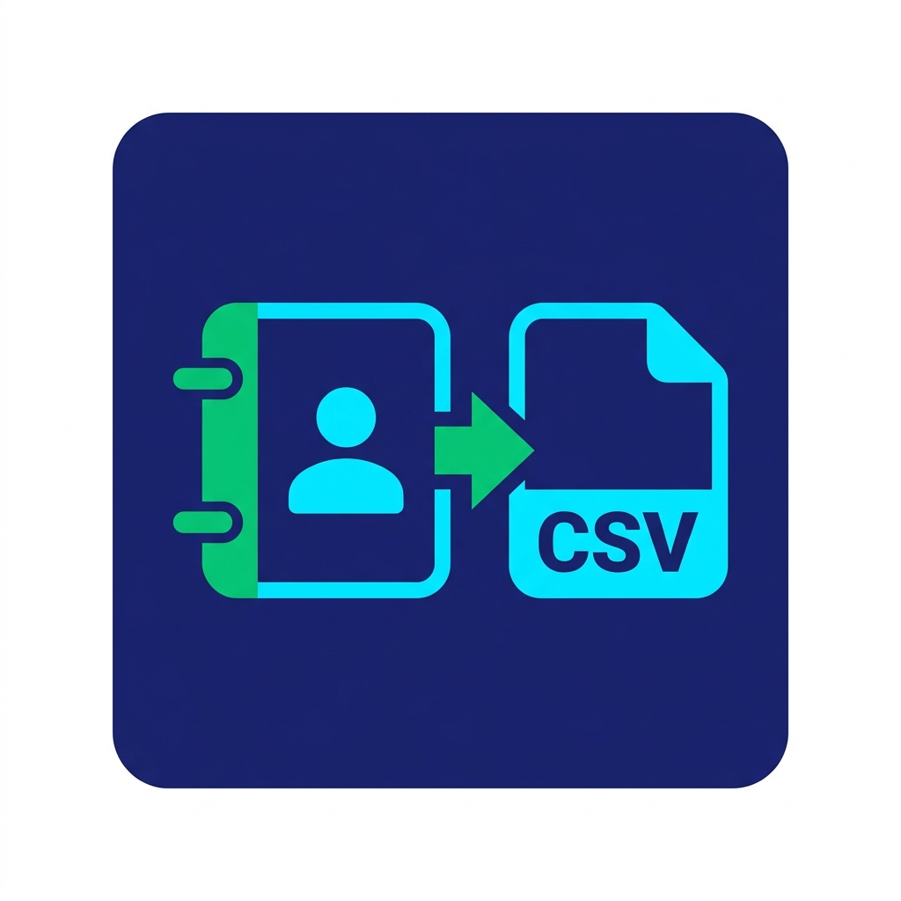

<p align="center">
  
  <h1 align="center">Contacts Exporter</h1>
  <p align="center">
    <b>A modern, cross-platform Flutter application to scan, filter, and export contacts from SIM cards, Google accounts, iCloud, and device storage to CSV files.</b>
  </p>
  <p align="center">
    <a href="https://github.com/alierenaltindag/ContactsExporter/releases/latest">
      
    </a>
    <a href="LICENSE">
      
    </a>
  </p>
</p>

---

## 🌟 Key Features

- **📱 Cross-Platform Compatibility**: Fully compatible with Android (API 21+) and iOS devices.
- **📥 Contact Import & Custom Column Mapping**:
  - Pick any `.csv` or `.txt` contact file from local device storage.
  - Interactive **CSV Column Mapper**: Auto-detects headers and allows mapping custom CSV columns to `First Name`, `Last Name`, `Phone Number`, and `Display Name`.
  - **Target Account Source Selection**: Choose destination storage account (Google Account, SIM Card, Local Storage, etc.).
- **🔄 Duplicate Avoidance & Name Override ("Skip existing phone numbers")**:
  - **Phone Normalization**: Trims spaces, dashes, parentheses, and leading zero/country codes for accurate matching.
  - **Duplicate Prevention**: Prevents creating duplicate entries for existing phone numbers, while updating existing contacts' First and Last Names with new CSV data.
  - Interactive localized tooltip explaining duplicate & override behavior.
- **🛡️ Automatic Pre-Import Backup & History Rollback (Undo)**:
  - **Automatic Pre-Import Backup**: Creates a complete JSON backup of device contacts prior to every import session.
  - **Import History**: Displays past imports with date, filename, target account, and `+Added`, `~Updated`, `øSkipped` badges.
  - **Rollback (Undo)**: Safely rollback any past import with a single click to remove newly created contacts and restore state.
- **🔍 Multi-Source Storage Account Scanning**:
  - Automatically queries all contact storage locations: **SIM Cards**, **Google Accounts**, **iCloud**, **Exchange**, and **Device Local Storage**.
  - Displays real-time contact counts per storage account.
  - **Zero-Contact Hiding**: Accounts with 0 contacts are automatically hidden from filter options.
- **⚡ Advanced Text Search & Match Criteria**:
  - **Contains**: Finds matches anywhere within contact name or phone number.
  - **Starts With**: Evaluates if the full merged contact name string starts with the query string.
  - **Ends With**: Evaluates if the full merged contact name string ends with the query string.
  - **Exact Match**: Evaluates if the full merged contact name string equals the query string exactly.
  - **High Performance**: Pre-computed string normalizations ensure smooth 60 FPS scrolling and instant search filtering.
- **📊 CSV Exporting**: Generates clean, properly formatted CSV files with separate columns:
  - `First Name`
  - `Last Name`
  - `Phone Number`
  - `Display Name`
  - `Account Source`
- **📤 Native File Sharing**: Opens the native OS Share Sheet to share generated CSV files via WhatsApp, Mail, Drive, Telegram, Files, etc.
- **🎨 Modern Dark Mode Design**: Obsidian dark background, slate cards, indigo accents, and emerald green badges.
- **🌐 Internationalization (i18n)**:
  - Supports **English** and **Turkish**.
  - **Automatic Locale Detection**: Automatically starts in Turkish if device system locale is Turkish; defaults to English otherwise.
  - Quick runtime language toggle button in the app bar.

---

## 🛠️ Tech Stack & Packages

- **Framework**: [Flutter 3.x](https://flutter.dev) (Dart 3.x)
- **UI Design**: Material Design 3 Dark Theme
- **Contact Access**: [`flutter_contacts`](https://pub.dev/packages/flutter_contacts)
- **File Picker**: [`file_picker`](https://pub.dev/packages/file_picker)
- **Permissions Handling**: [`permission_handler`](https://pub.dev/packages/permission_handler)
- **CSV Encoding**: [`csv`](https://pub.dev/packages/csv)
- **File Distribution**: [`share_plus`](https://pub.dev/packages/share_plus)
- **Path Resolution**: [`path_provider`](https://pub.dev/packages/path_provider)
- **Date Formatting**: [`intl`](https://pub.dev/packages/intl)

---

## 📁 Project Structure

```text
contacts_exporter/
├── android/               # Android native configuration & manifests
├── ios/                   # iOS native configuration & Info.plist
├── assets/
│   └── images/
│       └── app_logo.png   # Application icon asset
├── lib/
│   ├── l10n/
│   │   └── app_localizations.dart      # English & Turkish translations
│   ├── models/
│   │   ├── contact_model.dart          # Contact models & cached filter logic
│   │   └── import_model.dart           # Import mapping & history models
│   ├── services/
│   │   ├── contact_service.dart        # Contact fetching, CSV export & sharing
│   │   └── import_service.dart         # CSV parsing, backup & rollback engine
│   ├── theme/
│   │   └── app_theme.dart              # Dark theme specification
│   ├── ui/
│   │   ├── home_screen.dart            # Main screen & mode switcher
│   │   ├── import_view.dart            # CSV import & column mapping view
│   │   └── import_history_dialog.dart  # Import history & undo dialog
│   └── main.dart                       # Application entrypoint
├── test/                               # Unit and widget test suite
├── pubspec.yaml                        # Flutter dependencies and assets configuration
├── LICENSE                             # MIT License
└── README.md                           # Project documentation
```

---

## 🚀 Getting Started

### 📥 Quick Download (Pre-built Android APK)

Don't want to build from source? Download the latest pre-compiled Android APK:
- 📦 [**Download `ContactExporter.apk`**](https://github.com/alierenaltindag/ContactsExporter/releases/latest/download/ContactExporter.apk)
- 🏷️ [View All Releases](https://github.com/alierenaltindag/ContactsExporter/releases)

---

### Prerequisites

- [Flutter SDK](https://docs.flutter.dev/get-started/install) (v3.19.0 or higher)
- [Android Studio](https://developer.android.com/studio) / Android SDK (API 34/35) or [Xcode](https://developer.apple.com/xcode/) (for iOS)

### Installation

1. **Clone the Repository**:
   ```bash
   git clone https://github.com/alierenaltindag/ContactsExporter.git
   cd ContactsExporter
   ```

2. **Install Dependencies**:

   ```bash
   flutter pub get
   ```

3. **Run Static Analysis & Tests**:

   ```bash
   flutter analyze
   flutter test
   ```

4. **Run the Application**:

   ```bash
   # Connect an Android or iOS device / emulator
   flutter run
   ```

5. **Build Release APK (Android)**:
   ```bash
   flutter build apk --release
   ```
   The APK will be generated at `build/app/outputs/flutter-apk/app-release.apk`.

---

## 🔒 Permissions & Platform Setup

### Android (`android/app/src/main/AndroidManifest.xml`)

```xml
<uses-permission android:name="android.permission.READ_CONTACTS" />
<uses-permission android:name="android.permission.WRITE_CONTACTS" />
```

### iOS (`ios/Runner/Info.plist`)

```xml
<key>NSContactsUsageDescription</key>
<string>This application requires access to contacts in order to search, filter, and export contact records to CSV files.</string>
```

---

## 🤝 Contributing

Contributions, issues, and feature requests are welcome!
Feel free to check the [issues page](../../issues).

1. Fork the Project
2. Create your Feature Branch (`git checkout -b feature/AmazingFeature`)
3. Commit your Changes (`git commit -m 'Add some AmazingFeature'`)
4. Push to the Branch (`git push origin feature/AmazingFeature`)
5. Open a Pull Request

---

## 📄 License

Distributed under the MIT License. See [`LICENSE`](LICENSE) for more information.
